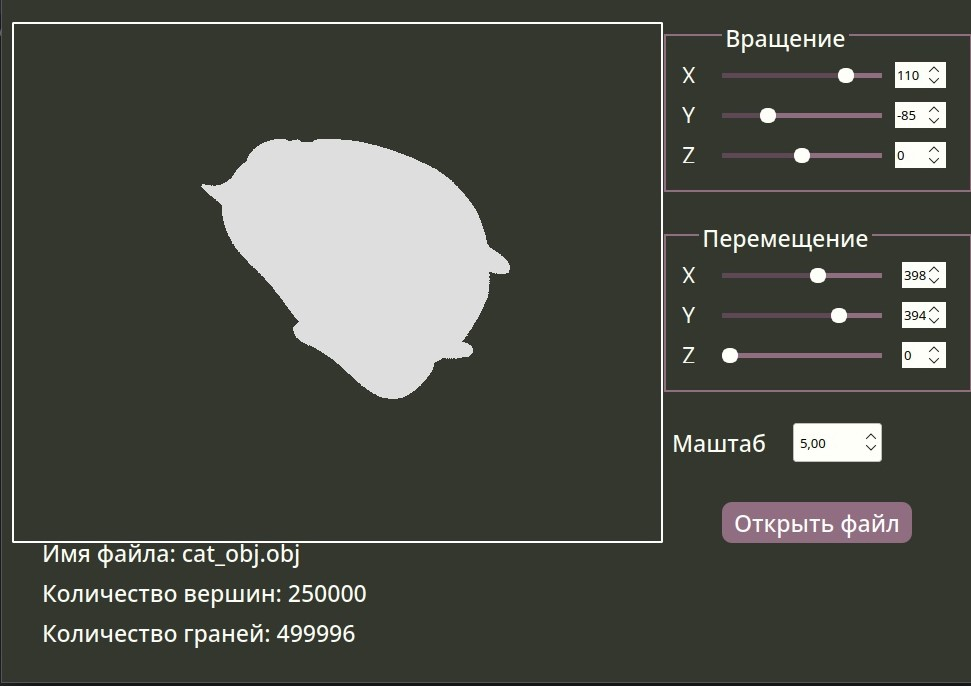

@mainpage 
# About the 3DViewer v1.0

Implementation of the 3DViewer v1.0 program for viewing 3D models in wireframe form. The models themselves must be loaded from .obj files. It is possible to view them on the screen with the ability to rotate, scale and move.

## Project Build

The project is built with the `make` command in the `src` folder, there are the following targets:  
- `all` - build an app,  
- `install` - install the application in the build folder,  
- `uninstall` - uninstall,  
- `dvi` - opening help,  
- `dist` - archiving the project,  
- `test` - Run unit tests for model part of an app,  
- `gcov_report` - view test coverage (lcov utility is required),  
- `style` - converting code to clang-format style,  
- `valgrind` - check for leaks with valgrind utility,  
- `leaks` - check for leaks with the leaks utility on Mac OS,  
- `rebuild` - rebuild the project,  
- `clean` - clean the project from temporary files.

## Description

- The program is developed in C11 using the gcc compiler.
- The program code is located in the src folder 
- The program assembly should be set up using a Makefile with the standard set of targets for GNU programs: all, install, uninstall, clean, dvi, dist, tests, gcov_report.
- The program is developed in accordance with the principles of structural programming
- Unit-tests cover modules related to model loading and affine transformations
- There can be only one model on the screen at a time.
- The program provides the ability to:
    - Load a wireframe model from an obj format file (support for vertex and surface list only).
    - Move the model at a specified distance relative to the X, Y, Z axes.
    - Rotate the model by a specified angle relative to its X, Y, Z axes.
    - Scale the model by a specified value.
- The program implements a graphical user interface, based on QT
- The program allows you to configure the type of projection (parallel and central).
- The program allows you to configure the type (solid, dashed), color and thickness of edges, display method (absent, circle, square), color and size of vertices.
- The program allows you to select the background color

 ## Screenshots

   
